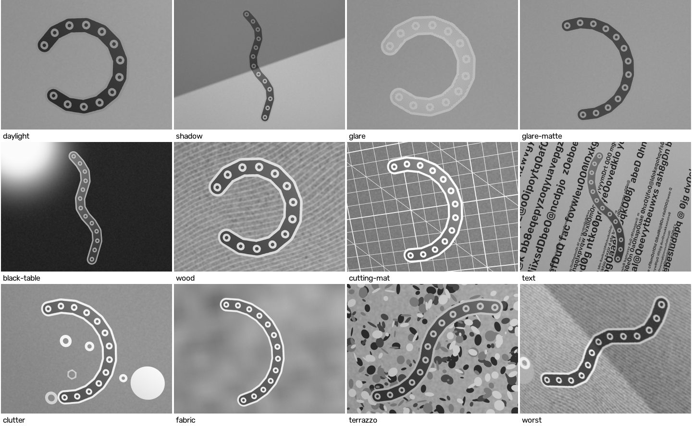
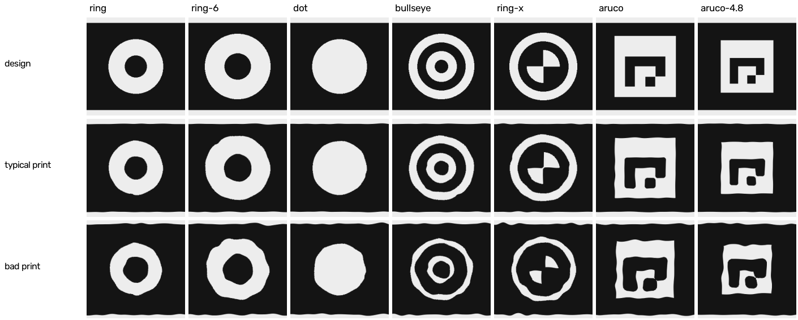

# Detection robustness and fiducial design

How the detector holds up in realistic phone photos of a 3D-printed chain, what was changed to make it hold up, and which fiducial works best for a 0.4 mm nozzle. Everything here is simulated; real photos (next-steps item 1) still have to confirm it.

## Summary

- **The whole chain is now recovered in 155 of 167 simulated photos, up from 77**, over 29 named environments plus 80 random ones. When the chain is recovered, the worst pin is off by 0.023 mm (median), 0.056 mm (95th percentile), 0.13 mm at most: far inside the 1 mm target.
- **The one failure left is glare on shiny filament.** A lamp reflected in the black layer washes it out until it is as light as the white rings. With **matte** black filament every simulated photo worked (32/32 random setups, including 5 with the lamp reflected on the chain). Standard PLA: 32/34. Glossy or silk: 10/14, and 0/3 with a reflection.
- **Keep the plain ring.** Of seven fiducial designs printed through the same 0.4 mm-nozzle model, the plain ring (as now, 5.0/2.0 mm) is the most robust. A 20% larger ring (6.0/2.4 mm) is equally robust and ~20% more accurate, and works from further away, but leaves only 1 mm of black around it on the 8 mm link. Designs with 0.8 mm features (bullseye, checker-corner centre, ArUco tags) print, but fall apart with blur, distance or a bad print; ArUco tags don't fit an 8 mm round-ended link at all.
- **Print defects, not the camera, set the remaining error.** Seam blobs and edge wobble move the printed ring off its pin by a few hundredths of a millimetre. Lens distortion, perspective bias of ellipse centres and the relief of the black layer each matter less.



## 1. The simulator — `splinewire/scene.py`

`render_scene(pins, spec, env, design)` renders a phone photo of a printed plaque or chain, returning the image and where each pin centre really is in it. `PRESETS` holds 29 named environments (one hard factor at a time, then combinations); `random_environment` draws every factor at once. `uv run splinewire synth --env glare` writes one as a JPEG with EXIF.

| factor | model | range (random) |
|---|---|---|
| **Print** (0.4 mm nozzle) | Convex black corners rounded to ~half the line width (0.2 mm), black features narrower than a line vanish, white gaps under ~0.2 mm close, all edges move by the over-extrusion, smooth wobble (~1 mm correlation), a seam blob on every circular edge, extrusion lines on the top surface that modulate brightness and gloss. The black layer stands proud of the white; its walls are ray-traced. | corners 0.15–0.25 mm, over-extrusion −0.08…+0.15 mm, wobble ≤0.04 mm, seams ≤0.15 mm, relief 0.2/0.4/0.6 mm |
| **Mount** | test plaque (white plate, rim), bare chain on the table, laser print on paper | |
| **Filament** | black and white PLA albedo; specular reflectance and lobe width by type: matte, standard ("basic"), glossy/silk | 35% / 45% / 20% |
| **Table** | paper, graph paper, printed text (ring-like letters), wood, black, grey, green cutting mat, woven fabric, terrazzo; glossy tables reflect the lamp | |
| **Clutter** | washers (6–10 mm; one always in line with a chain end, 1–2 pitches out), nuts, coins | 0–8 objects |
| **Light** | ambient + a lamp (1/r², Blinn-Phong highlight), optionally placed so its reflection lands on the chain; gradient; soft shadow edge or band across the chain (phone, hand, pencil); vignetting | ambient 20–90%, shadow penumbra 2–20 mm |
| **Camera** | 12 MP (or 3 MP, as after a messaging app), 24–28 mm equivalent; tilt, roll, chain anywhere in the frame; residual radial distortion; depth-of-field defocus from the real aperture; hand shake; lens blur | 3.5–17 px/mm, tilt 0–40°, k1 ±0.015 |
| **Sensor, ISP** | centre-weighted auto-exposure with a highlight shoulder, shot + read noise, edge-preserving denoise, sharpening, sRGB, JPEG | gain 1–16×, JPEG 70–95 |

The truth is checked in `tests/test_scene.py`: on a perfect print the detected rings land within 0.15 px of the true pins; with lens distortion, within 0.2 px of where the distortion puts them. The black layer's walls hide the same share of every window edge, so the rings look as if they lay at half the relief height: still one plane, so deskewing is unaffected (as `experiments/relief_bias.py` found). Pixel truth is taken on that plane.

Not modelled: colour (the detector works on gray), chromatic aberration, rolling shutter, multi-frame HDR artefacts, a warped print, fingers or objects over the chain, and the chain hardware's own joint play.

## 2. Benchmark — `experiments/cv_benchmark.py`

Five chain shapes (S-curve, pipe, cove, tight wrap, wave), three photos per preset with different view directions, and 80 random environments. "Chain" is the whole chain recovered in order, with no stray ring taken for a pin.

| environment | before: chain | after: chain | after: worst pin, mm |
|---|---|---|---|
| ideal (the old synthetic photo) | 3/3 | 3/3 | 0.002 |
| daylight (typical: plaque, paper, lamp) | 3/3 | 3/3 | 0.021 |
| far / very far (5, 3.2 px/mm) | 3/3, 3/3 | 3/3, 3/3 | 0.022, 0.061 |
| close (18 px/mm) | 1/3 | 3/3 | 0.023 |
| steep (45°), misfocus, shake, dim | 3, 2, 3, 3 /3 | 3/3 each | ≤0.028 |
| shadow edge / shadow band | 1/3, 0/3 | 3/3, 3/3 | 0.078, 0.040 |
| black, grey table | 1/3, 0/3 | 3/3, 3/3 | 0.022, 0.050 |
| wood, cutting mat, fabric, terrazzo | 1, 1, 1, 2 /3 | 3/3 each | ≤0.047 |
| printed text (~140 ring-like letters) | 0/3 | 3/3 | 0.030 |
| clutter (washers, nuts, coins) | 1/3 | 3/3 | 0.022 |
| bad print, bare chain | 0/3, 1/3 | 3/3, 3/3 | 0.052, 0.027 |
| lens (k1 = 0.03, chain in a corner), JPEG 45 at 4 px/mm | 3/3, 3/3 | 3/3, 3/3 | 0.062, 0.097 |
| worst (several at once) | 2/3 | 3/3 | 0.059 |
| lamp reflected in matte PLA | 3/3 | 3/3 | 0.021 |
| lamp reflected in standard / glossy PLA | 0/3, 0/3 | 0/3, 0/3 | – |
| **random environments** | **27/80** | **74/80** | 0.130 |
| **all** | **77/167** | **155/167** | median 0.023, p95 0.056 |

Random environments by filament, after: matte 32/32, standard 32/34, glossy 10/14 (0/3 with the lamp reflected on the chain). All six random failures are a lamp reflected in standard or glossy filament (placed there, or close enough by chance).

Runtime: 0.4–1 s per 12 MP photo, the printed-text page (~140 ring-like letters to refine) included.

## 3. What broke, and the fixes — `detect.py`, `order.py`, `pipeline.py`

Each fix came from a failure the benchmark found.

1. **Extrusion lines bridge rings to their surroundings.** Under a lamp the top surface's lines show as bright stripes 0.42 mm apart, which cross the 1.5 mm black margin and join a ring to the white rim: no longer a blob with one hole. Candidates are now found on an image pyramid (full, ½, ¼, ⅛ size), so each ring is also seen where it is a few dozen pixels across and the stripes have averaged away.
2. **Threshold windows a quarter of the image wide** mixed the table, rim, shadows and glare into each ring's threshold. Windows are now 25 px at every pyramid level, one or two rings wide. Candidate recall over the benchmark photos (true pins with a candidate): 90.3% with 81 px windows, 96.3% at 31 px, 96.6% at 25 px.
3. **Sheen makes a black link lighter than the table beside it** (bare chain on wood): the link then sits above the local mean and the ring merges into it. A second mask, mean + 0.8 local standard deviations where there is contrast, still isolates the ring, the brightest thing around. It also covers what the old midrange mask did (black chain on a black table), which was dropped.
4. **Seam blobs fail a strict ellipse test at close range** (8/13 rings found at 18 px/mm): a blob 0.1 mm high is 2 px there. The contour test now allows a few stray points (90th percentile), and the precise fit rejects outliers.
5. **Relief at steep angles** makes the raised centre disc look rounder than the window around it; the inner/outer shape check was loosened accordingly.
6. **Sub-pixel accuracy from gray levels, not a binary image.** Each candidate is refined on the full-resolution photo along 32–180 rays: each edge is where the profile crosses halfway between *that ray's* dark and bright levels, so a shadow edge or glare gradient across a ring does not shift it. Ellipses are fitted to the edge points with outlier rejection.
7. **Weighting the two ellipse centres by area as well as fit quality**: a print defect pulls a small circle's fitted centre further than a large one's (∝ 1/radius). Median worst-pin error −20%, 95th percentile −21%.
8. **Printed letters broke ordering.** With ~100 ring-like "O", "0", "@" detections, the median nearest-neighbour distance (the old pitch estimate) was the letter spacing. Each ring's own ellipse now predicts the step to the next pin (pitch = 2 ring diameters, foreshortened at most by the ellipse's axis ratio), neighbours must match in size, and light-on-dark rings are never chained with dark-on-light ones (printed letters).
9. **A washer one pitch past the chain end** joins the chain by geometry. After deskewing, a pin whose ring is >12% off its neighbours' size in mm, or an end pin whose link is far from one pitch, is dropped and the chain re-solved. A washer of exactly a ring's size (an M2 washer is 5.0/2.2 mm) passes both; then the chain has one pin too many, and the end that looks least like its neighbours (what surrounds it: a link, or the table; and size) is dropped.
10. **Speed.** Ring-scale thresholds turn woven fabric into ~300,000 specks; tracing them took 20 s per photo. Connected components are filtered by size and fill first, and only plausible ones traced: 0.5 s.

## 4. Where the remaining error comes from

- **Print defects dominate.** On the worst benchmark photo (0.16 mm), rendering without print defects gives 0.06 mm; without lens distortion, relief, defocus or noise, it hardly changes. Seams and wobble genuinely move a printed ring off its pin, and a small circle most: hence the area weighting (fix 7) and the case for larger rings (§5).
- **Lens distortion is minor** (`experiments/lens_distortion.py`, 12 MP, 300 mm away, 0.1 px noise):

  | k1 | chain centred | chain in a corner |
  |---|---|---|
  | 0 | 0.03 mm | 0.02–0.04 mm |
  | 0.01 | 0.03 mm | 0.03–0.04 mm |
  | 0.02 | 0.03–0.04 mm | 0.05–0.07 mm |
  | 0.04 | 0.03–0.05 mm | 0.09–0.14 mm |

  Adding k1 to the deskew fixes straight and S-shaped chains, but on arcs, where distortion and curvature trade off, it makes things worse: 0.15–0.26 mm even with no distortion at all. `rectify_chain(estimate_distortion=True)` exists for the experiment; the pipeline leaves it off.
- **Perspective bias of ellipse centres** (the image of a circle's centre is not the centre of its image ellipse) is ~f·(r/Z)²·sin(2·tilt)/2: about 0.07 px for a 12 MP photo from 300 mm at 25°, 4× that from half the distance. It is nearly the same shift for every pin, so the measured shape moves by ~0.002 mm (the ideal photos).
- **Relief** makes the rings look as if they lay 0.2 mm up: one plane, no effect.
- **Glare** is the limit on *detection*: at the mirror angle, satin black PLA's highlight is about twice as bright as diffuse white PLA, so the contrast between ring and link is gone, not merely low.

## 5. Fiducial options for a 0.4 mm nozzle — `experiments/fiducial_study.py`

All designs are windows cut into the black top layer over white, centred on the pin, inside the 8 mm link (`splinewire/fiducials.py`). A 0.4 mm nozzle lays ~0.42 mm lines: two lines (0.8 mm) is the narrowest band that prints dependably, convex black corners round off by ~0.2 mm, and white gaps under ~0.2 mm fill in.



| design | narrowest feature | black margin to link edge | notes |
|---|---|---|---|
| **ring** 5.0/2.0 mm (current) | 1.5 mm band (3.5 lines), 2.0 mm centre | 1.5 mm | |
| ring-6 6.0/2.4 mm | 1.8 mm band, 2.4 mm centre | 1.0 mm | |
| dot, 5.0 mm | 5.0 mm disc | 1.5 mm | no hole: any bright blob is a candidate |
| bullseye 6.0 mm | 0.8 mm bands, 1.2 mm centre dot | 1.0 mm | four edges to fit |
| ring-x 6.2 mm | 0.8 mm band and gap, checker corner in a 3.0 mm disc | 0.9 mm | centre from the checker's saddle point (`cv2.cornerSubPix`), exact under perspective |
| ArUco 4×4, 5.6 mm | 0.93 mm cells | 0.04 mm at a round chain end | printed inverted (white border); ids give the order |
| ArUco 4×4, 4.8 mm | 0.8 mm cells | 0.4 mm | |

Each design went through the same renderer and a detector suited to it (the production ring detector; blobs for the dot; all four edges for the bullseye; ring then saddle point for ring-x; OpenCV ArUco with id ordering), then the same ordering and deskewing.

**Environments** (26 presets × 2 photos + 40 random, 92 photos): chain recovered / worst-pin error of recovered photos, median · 95th percentile.

| ring | ring-6 | dot | bullseye | ring-x | ArUco 5.6 | ArUco 4.8 |
|---|---|---|---|---|---|---|
| **87/92**<br>0.026 · 0.069 mm | **87/92**<br>0.020 · 0.062 mm | 71/92<br>0.025 · 0.071 mm | 77/92<br>0.023 · 0.053 mm | 76/92<br>0.024 · 0.126 mm | 2/92<br>0.087 mm | 16/92<br>0.049 · 0.172 mm |

**Resolution** (typical conditions, 3 photos each): the lowest px/mm at which every photo worked.

| ring | ring-6 | dot | bullseye | ring-x | ArUco 5.6 | ArUco 4.8 |
|---|---|---|---|---|---|---|
| 2.5 | **2.0** | 2.5 | 4.0 | 4.0 | never (≤6.5) | none of 3 at ≤5, 2/3 at 6.5 |

**Hand shake** at 8 px/mm: the rings and the dot work up to a 16 px (2 mm) streak; bullseye and ring-x fail from 12 px.

What it shows:

- **Plain rings are the most robust**, and their accuracy is far better than needed. Their 1.5–1.8 mm bands survive blur, distance and bad prints (see the figure), and the hole makes them hard to mistake for clutter.
- **ring-6 vs ring**: equally robust here, ~20% more accurate and usable from further away, because print defects move a larger circle's centre less and it has more edge pixels. The cost is the black margin: 1.0 mm instead of 1.5 mm. With less margin, sheen and blur bridge the ring to its surroundings more easily, and the reading of what surrounds each ring (used to reject a ring-sized washer) picks up the rim: on the plaque it read 185 instead of ~95 at two pins.
- **The dot** has no hole to tell it from anything bright and round: ~100 false detections per photo, and it failed every terrazzo and bare-chain photo. A solid disc wider than a threshold window also gets hollowed out, so it has to be caught at a coarser pyramid level.
- **Bullseye and ring-x** have the most precise centres when they are found (ring-x's saddle point is good to ~0.01 mm on a clean print), but their 0.8 mm features need 4 px/mm, fail with shake, and distort visibly in a bad print. The saddle point also follows print defects near the pin, so its worst case (0.34 mm) is the worst of any ring-type design.
- **ArUco** cannot work here. Square markers big enough for 0.4 mm-nozzle cells don't leave a dark quiet zone inside a round-ended 8 mm link (the 5.6 mm marker loses both end pins every time), corner localisation is 2–5× worse than an ellipse fit, and the cells need ≥6.5 px/mm. Ids would solve ordering and mirror detection, but ordering is already reliable.

**Recommendation.** Keep the plain ring, 5.0/2.0 mm, printed as windows in a two-layer black top over white, in **matte** black. If the real chain's links can be ~9 mm wide, a 6 mm ring (keeping a 1.5 mm black margin) buys the ring-6 gains without its cost. Rules of thumb for any size: band ≥1.5 mm (≥3.5 lines), centre ≥2 mm, inner/outer ≈ 0.4, ≥1.5 mm of black around it.

For the real chain, print the ring in one piece with the link so its centre is the pin hole's centre to within print accuracy, and keep the pin out of the ring's centre: an edge formed by a pin head would shift the centre by the hole's clearance.

## 6. Photo and print guidance

- **Matte black filament**; no ironing (it makes the top glossy).
- **Keep lamps out of the reflection.** If the black links look grey or shiny on the phone screen, move the light or tilt the phone a little. Diffuse light (a window, an overcast day) is best.
- **Distance barely matters with a full-resolution photo**: rings need ~2.5 px/mm, which a 12 MP phone at 26 mm-equivalent still gives from ~1.2 m. Photos shrunk by a messaging app to ~1600 px wide reach that limit at ~0.5 m.
- **Tilt up to ~40°, any table**: shadows, printed pages, wood, fabric and clutter are all handled. A plain matte surface is still the safest.

## Reproduce

```bash
uv run python experiments/cv_benchmark.py --baseline 752b3a9   # ~15 min first time (renders cached in out/)
uv run python experiments/fiducial_study.py                     # ~40 min: environments, resolution, blur
uv run python experiments/fiducial_study.py --figure docs/img/fiducials-printed.png
uv run python experiments/contact_sheet.py docs/img/environments.jpg
uv run python experiments/lens_distortion.py
uv run splinewire synth --env glare --shape pipe                 # look at one
```
