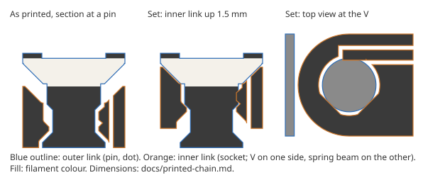
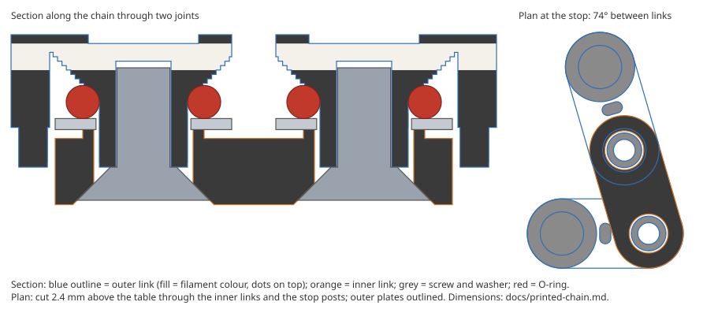

# Print-in-place chain

A working measuring chain that comes off a single-extruder FDM printer assembled: it bends at every pin, holds its pose by friction, and keeps every link one pitch long. It matches `data/chain.yaml` (10 mm pitch, 8 mm wide links with round ends, a 5 mm dot on every pin, 13 pins), so the software needs no changes. Code: `splinewire/printed_chain.py`.

```bash
uv run splinewire print-chain                 # out/print-chain/chain.stl, -black/-white.stl, -PRINTING.txt, -joint.svg
uv run splinewire print-chain --pins 3        # one test joint (outer link, inner link, end button)
uv run splinewire print-chain --clearance 0.35 --preload 0.1
```

Nothing here has been printed yet. Everything below is checked on the geometry only (`tests/test_printed_chain.py`).



## The problem: clearance means play

A print-in-place joint needs a gap of about 0.3 mm between its parts, or they fuse. That gap lets each pin wander in its socket, and the deskew assumes every link is exactly one pitch long. In simulation (pins moved at random within 0.3 mm, 25° tilt, true focal length) that play alone costs 0.22–0.25 mm worst pin. The first real photo of the printed plaque measured 0.1 mm. A joint with play also has no friction, so the chain could not hold the shape it was given. The design below takes the play out after printing, and the friction comes from the same spring.

## Layout

Links alternate, as on a bicycle chain:

- **Outer links** (the ones with dots): a top plate with a pin hanging from each end. Both dots of an outer link sit on its own pins, so its two dots are always exactly one pitch apart. Every pin, and so every dot, belongs to an outer link. A web under the plate, between the pins, holds the plate up while it prints. It is cut back so the inner links can turn ±90°.
- **Inner links**: a bottom plate with a socket at each end.
- With 13 pins (12 links) the last link is an inner one, so a loose **end button** (a pin with a cap and a dot) fills its last socket. With an even pin count there is no button.

Outer and inner links sit at different heights, so a joint's range is limited only by the outer links' webs: ±90° (the ordering assumes ≤80°). The outline in plan is the stadium the contact model assumes: the outer plates at the top and the inner plates at the bottom both have the full 8 mm width and round ends on the pins.

## The joint

Each pin is a solid of revolution, from the bed up:

| | radius | height (mm) |
|---|---|---|
| foot (retains the inner link) | 2.45 | 0–0.4, then a 45° cone in |
| neck | 1.65 | 1.2–2.95 |
| barrel (held once set) | 2.1 | 3.4–5.0 |
| shoulder (flat stop, 0.3 mm) | 2.4 | 5.0 |
| cap cone, 45° out to the plate | 2.4 → 4.0 | 5.0–6.6 |
| plate | link outline | 6.6–7.4 |

The inner link's socket is the pin's shape swept through the set travel and grown by the 0.3 mm clearance. So the parts are 0.3 mm apart as printed. Wherever one part prints above another, the surface between them is a 45° cone, so nothing needs support and no surface prints flat onto a gap that it could sag into and fuse. The only flat overhangs left are the 0.3 mm shoulder ring and short bridges in the outer plate over open air. The test slices the parts every 0.2 mm and checks that no part's overhang lies within 1 mm above another part, and that no part starts in mid-air.

**Taking the play out.** In each socket, at the land (a 0.6 mm slab at 2.2–2.8 mm), the inner link has:

- a rigid 90° V on one side, its flanks tangent to the barrel's circle;
- on the other side, a ridge on a spring beam. The beam is a 0.8 mm blade, 5 mm long, cut free from the link by 0.35 mm slots and anchored at the link's middle. Its face sits 0.15 mm (`--preload`) inside the barrel's circle.

As printed, the land faces the pin's thin neck with 0.3 mm to spare. After printing, each inner link is pressed toward the outer plates, about 1.5 mm until the shoulder stops it. That brings the barrel down into the land along 45° chamfers. The spring bends 0.15 mm and holds the barrel in the V. The pin is now located in the socket by rigid geometry, with no play. Each V faces across its link, so a V or barrel that prints a little large moves the pin sideways and leaves the pitch unchanged to first order. Errors in the pitch then come from the printer's XY scale, as on the plaque.

Rough numbers for PLA (a cantilever as tall as the inner link, E = 3.5 GPa, μ = 0.35): spring force 2.6 N, bending stress 25 MPa, and friction torque about 4.6 N·mm per joint (the spring and both V flanks press on a 2.1 mm radius). The whole chain weighs about 6 g (5 cm³). Held level by one end, its first joint carries about 4 N·mm, so that is near the limit. Lifted with a hand under it and laid down, as in use, the chain is well inside it. PLA relaxes under constant stress, so expect the friction to drop over weeks. The pin stays in its V as long as any preload is left.

**Which way it sets.** The inner links move up toward the outer plates. In use the chain lies dots up and rests on the outer links (their feet and webs). The inner links hang 1.5 mm above the table, with their tops recessed below the outer plates. Pressing on the chain, on its dots or with a flat hand, pushes the outer links against the table and leaves the joints alone. Only pushing an inner link down from its recessed top could undo a joint, and that link can simply be pressed again.

## Colours

The chain uses one extruder and two filament changes, both at heights on the 0.2 mm layer grid:

- **Black** up to 4.8 mm: the inner links all through, and the bottom of the outer links.
- **White** from 4.8 to 7.0 mm: the pins under the dots, the lower part of the outer plates, and the inside of the webs.
- **Black** from 7.0 to 7.4 mm: the top of the outer plates. Each dot is a window 0.4 mm deep onto the white pin under it, as on the plaque (`experiments/relief_bias.py`: 0.4 and 0.8 mm deep windows bias the result by ≤0.011 mm).

Seen from above, everything is black except the dots. That includes the inner links' tops between the plates, which are only black because of the first change. A single change could not do this without windows 2 mm deep. A thin band of white shows on the plates' side walls at a tilt, as the plaque's white rim did.

## Printing and setting

`chain-PRINTING.txt` has the steps. In short:

1. Print it flat, dots up, with 0.2 mm layers, no supports and no brim. Use elephant-foot compensation, because the pins' feet are 0.3 mm from the inner links on the first layer. Turn XY hole/size compensation off.
2. Free each joint by working it left and right.
3. Set it. Lay the chain dots down on a hard table and press the middle of each inner link toward the table until it stops.
4. Check that no joint has play and that each turns with even friction. Then check the length: 128.0 mm end to end when straight.

## Open risks (to find out by printing `--pins 3` first)

- **Fusing.** 0.3 mm normal clearance is typical for print-in-place on a tuned printer. Slower printers, or poor cooling on the cones, may need `--clearance 0.35`. The first layer is the riskiest place: the foot sits next to the inner link.
- **Setting force and seating.** Pushing the barrel over the land needs roughly the spring force times two, about 5 N per socket. Whether the beam bends cleanly or the blade twists depends on the print.
- **Preload accuracy.** The 0.15 mm interference is close to FDM tolerance (±0.05–0.1 mm). Friction may vary from joint to joint, and the spring force varies by up to ±50%. Tune with `--preload`.
- **Creep.** PLA under 25 MPa relaxes, so retest friction after some weeks. PETG is less stiff and so gives less force for the same preload. It creeps less.
- **Thickness.** 7.4 mm, about the link's width, set mostly by the 45° cones. A thinner chain needs flat overhangs that print onto other parts, which is exactly what fuses print-in-place joints.
- **Thin parts.** The spring beam is two 0.4 mm lines, which prints fine as a vertical wall. The 0.35 mm slots either side of it are more likely to bridge shut. If they do, a more forgiving spring could help: 0.45 mm slots and a thicker beam with less preload.

## Alternatives considered

- **Copper wire through the chain to hold the pose** (instead of the spring's friction). Rejected for now, from rough numbers (annealed copper, yield 35–70 MPa, E 117 GPa):
  - **Springback.** Copper is elastic below yield, so each bent joint relaxes by about 6.8 σ_y/E when the chain comes off the object. That is 0.12–0.23° per joint whatever the gauge, and in simulation it gives 0.15–0.6 mm worst pin (pipe R 25 mm: 0.31–0.63 mm). Friction joints in stiff plastic store almost nothing and do not spring back. Combining the two does not help: the friction would have to cancel the wire's springback, and then the wire does no work.
  - **Fatigue.** A bend concentrated at a joint strains the wire about 9% at 20° and 40% at 90°, so it cracks after tens of tight bends. Letting the wire curve smoothly through loose channels lowers the strain but increases the springback.
  - **Play.** The wire does not take out the joints' play, which the spring does. Play of 0.3 mm costs 0.23–0.34 mm worst pin in simulation (0.4 px centre noise, which matches the first real photo), against 0.08 mm without play. Deskewing from the outer links alone, whose dots are rigid, gets that to about 0.15 mm.
- **An elastomer instead of the printed spring.** Designed as the assembled O-ring chain below, for PETG.

The next-steps item 2 exit test applies unchanged. Wrap a gauge of known radius, photograph the chain, and the radius should come back within 0.5 mm.

# Assembled O-ring chain (PETG)

The same chain (10 mm pitch, 8 mm links, 5 mm dots, 13 pins), printed in separate parts in PETG and screwed together. Each joint takes one M3 countersunk screw, one O-ring and one small steel washer, all from assortment boxes, about $0.05 a joint. Code: `splinewire/oring_chain.py`.

```bash
uv run splinewire oring-chain                    # out/oring-chain/oring-chain.stl, -black/-white.stl, -assembled.stl, -PRINTING.txt, -joint.svg
uv run splinewire oring-chain --pins 4           # two-joint test piece: two outer links, one inner link
uv run splinewire oring-chain --squeeze 0.2 --margin 0.15 --screw-length 5
```

Nothing here has been printed yet. Everything below is checked on the geometry only (`tests/test_oring_chain.py`).



**Why not print in place.** PETG strings across the 0.3 mm gaps of a print-in-place joint and tends to fuse there. Printing the links apart removes that risk and the setting step; it costs an assembly step and some hardware.

## The joint

Heights as used, from the table up:

| | z (mm) |
|---|---|
| screw head's flat face (0.2 mm recessed) | 0.2 |
| inner link: countersink meets the hole (r 2.25) | 0.95 |
| head cone meets the shank; the outer link's sleeve ends here | 1.7 |
| inner link top / raised ring top (r 2.25–2.75) | 3.0 / 3.4 |
| steel washer, 4.3 × 8 × 0.5 (ISO 7092 M4) | 3.4–3.9 |
| O-ring 4 × 1.5 (NBR 70A), on the washer, under a 45° seat in the outer link | from 3.9 |
| bottom of the white / top of the white / top | 6.1 / 7.3 / 7.7 |

- **No play.** The O-ring pushes the inner link's 90° countersink down onto the screw head's cone, which centres it whatever size the hole printed. The outer link is centred by the screw's thread, which it cuts into a 2.5 mm hole printed with the dot, and squared up by the head it is clamped against. The screw stops when its head reaches the sleeve's end, so the O-ring's squeeze (0.25 mm into its seat) is set by the parts, not by how hard the screw is turned.
- **Friction without springback.** An O-ring that slipped on a part would first twist, storing a few degrees, and give some back when let go: about 0.4 mm at the next pin for 2°. So no rubber surface slips. The O-ring grips its seat and the washer; the joint turns where the steel washer slides on the inner link's narrow raised ring (r 2.25–2.75) and where the countersink slides on the head. The O-ring still stores twist up to the washer's friction. The countersink holds about 1.5× that (more normal force, from the 45° cone, at a larger radius, with the same steel on PETG), so a bent joint stays put. That 1.5 needs both surfaces to have about the same friction coefficient; it is the number to check first.
- **Rough numbers:** O-ring force ~9 N (NBR 70A data spread is about 2×), friction ~13 N·mm per joint (countersink 8, washer 5). The chain weighs about 11 g, about half of it steel. Held level by one end, its first joint carries about 7 N·mm, so it holds.

## Stop at 74°

At its stop a joint's links are 73.7° apart, so the pins either side of it are 1.2 pitches apart (2 · sin(θ/2) = 1 + margin, margin 0.2). The ordering then never finds a neighbour's neighbour nearer than a pitch at a single joint. Without a stop the links would collide at about 57°, where those pins are 9.5 mm apart.

The stop is a post under the middle of each outer link, a 1.3 × 2.37 mm stadium across the link. It clears the two inner links' round ends by 0.35 mm, and an inner link's side meets it at the stop. One post stops both joints of its outer link, either way. At the stop the outer plates on either side are still 1.6 mm apart.

Two joints together can still bring pins a pitch apart. A U-turn of two 90° bends puts its legs exactly one pitch apart, and only the plates touching stop them closer, at 8.4 mm. No stop at a single joint prevents that, and the print-in-place chain allows it too. The ordering handles it by turning as little as possible.

## Printing

Everything prints as used, dots up, on one bed, with no supports:

- Outer links stand on their sleeves' ends, the stop posts and, at a chain end, a foot under the free pin. Everything above grows from those at 45°, one 0.2 mm layer at a time. Below the inner links' top it stays out of their way, and around each pin it stays out of the washer and grows over the O-ring as its 45° seat. The only bridge is the 2.5 mm top of each screw hole.
- The dots are 0.4 mm deep windows in the black top onto white, as on the plaque. Two filament changes: white from 4.4 mm and black again from 5.6 mm (print heights). The inner links are 3.4 mm tall, so they stay black.
- Inner links print as used, with the countersink on the bed side as a 45° overhang.
- An outer link printed dots down would put its sleeve ends at the top of the print, where a cone would print best. Its dots would then be windows on the bed side that the white has to bridge across, sagging and striated. The dots matter more.

## Measuring photos of it

Set `max_bend_deg: 125` in `data/chain.yaml` (default 80, for the print-in-place chain), or in the app's settings. The joints stop at a 106° turn. Seen through a phone tilted by 35°, that can look like ~117°.

With the turn limit raised, the ordering walk would otherwise be tempted to skip the pin at a sharp bend: the pin after next is only 1.2 pitches away and needs half the turn. So a step that passes over an unvisited pin lying about a pitch from both its ends costs extra. Among walks that visit equally many pins, the one with fewer steps off a whole pitch wins. In tests with noise and foreshortening, single sharp corners, sharp S-bends, hooks and pitch-wide U-turns order correctly up to a 35° tilt. The one known failure: a zigzag with every joint at its stop, seen at a 35° tilt. Foreshortening then shrinks the 1.2-pitch skip to about one pitch in the photo, and about half the walks skip every other pin. Pins can be fixed by hand in the app.

## Open risks (to find out by printing `--pins 4` first)

- **Springback.** Bend a joint 90°, let go, photograph. The 1.5× margin above rests on equal friction coefficients for the washer and the countersink.
- **Outer link centring.** It relies on the self-cut thread and the head clamp, not a cone. Check that the pitch over 12 links matches the straight length (128.0 mm), and that a joint shows no play once screwed home.
- **Squeeze tolerance.** The seat and the stop come from layer heights, ±0.1 mm on a 0.25 mm squeeze. Joints may differ in friction; `--squeeze` regenerates the seat.
- **Thread in PETG.** An M3 cut into a 2.5 mm hole in 0.75 mm walls; cutting it once before assembly helps. Overtightening past the stop could strip it.
- **Stop post.** A 1.3 mm wide post, 1.65 mm tall below the web, takes the stop load. Forcing a joint past its stop could break it.
- **Parts.** ISO 7092 M4 washers (8 mm) and 4 × 1.5 O-rings are common in kits but not universal. A larger washer would not fit the 8 mm link.
- **Thickness.** 7.7 mm with M3 × 6 screws. M3 × 5 (`--screw-length 5`) makes it 6.7 mm.
